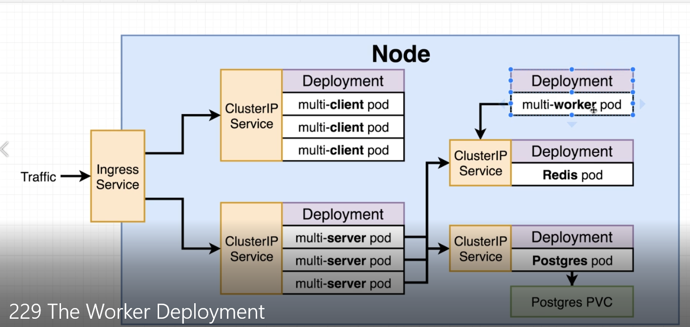

# client image

This image is a react project for presentation layer

# server image

this image contains the api request

# worker image

redis image for calculating the fib value inserted in the presentation layer

# postgres image

postgres database to store values

## Installation

### client image

```bash
docker build -t <dockerhub_username>/multi-client ./client
docker login
docker push <dockerhub_username>/multi-client
```

### server image

```bash
docker build -t <dockerhub_username>/multi-server ./server
docker login
docker push <dockerhub_username>/multi-server
```

### worker image

```bash
docker build -t <dockerhub_username>/multi-worker ./worker
docker login
docker push <dockerhub_username>/multi-worker
```

### network policy

```bash
minikube start  --driver=hyperv  --network-plugin=cni --cni=calico
minikube addons  enable ingress
kubectl describe service -n ingress-nginx ingress-nginx-controller
```

### apply k8s to cluster

```bash
kubectl create secret generic pgpassword --from-literal PGPASSWORD=password123
kubectl apply -f ./k8s
```